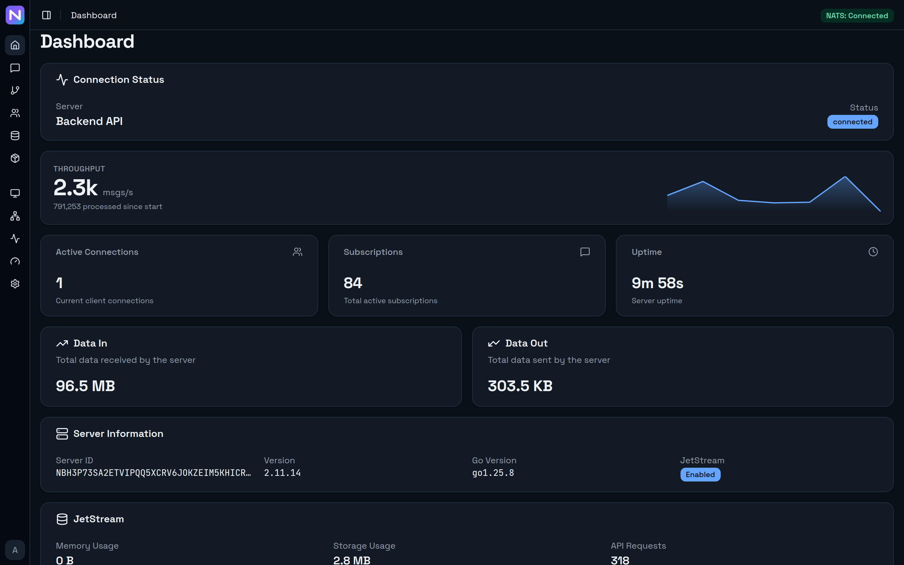
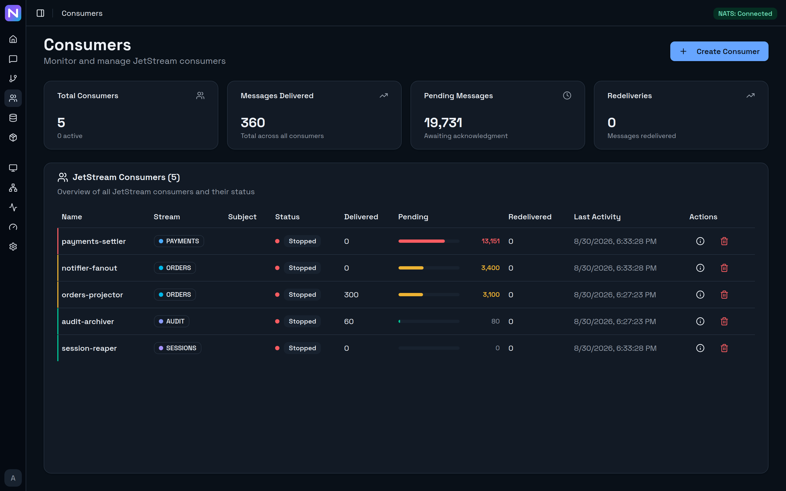
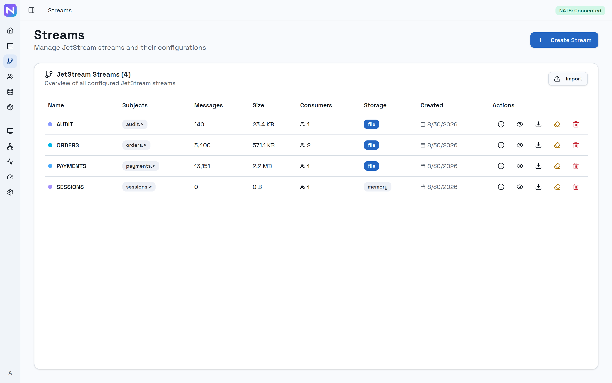

# NATS UI

Web interface for NATS JetStream monitoring and management.

Based on [gastbob40/nats-ui](https://github.com/gastbob40/nats-ui), rebuilt with a Go backend and JWT authentication.

## Architecture

- **Frontend** — React 19 + TypeScript + Tailwind CSS v4 + shadcn/ui
- **Backend** — Go (Gin) API server that connects to NATS and serves the frontend
- **Auth** — JWT-based with username/password and OAuth2 (Google, GitHub, Keycloak, generic OIDC)

The backend proxies all NATS operations through a REST API, eliminating the need for direct WebSocket connections from the browser.

## Screenshots

**Dashboard** — throughput leads, with the counters that give it context underneath.



**Consumers** — lag is a shape, not a figure to compare across rows. Each consumer carries a stripe and a bar coloured by how far behind it is (healthy, over 1k pending, over 10k), the worst sits at the top, and every stream keeps a stable identity colour wherever it appears.



**Streams** — the same system in the light theme.



## Features

- **Dashboard** — Server info, JetStream stats, connections, resource usage
- **Streams** — Create, update, delete, purge streams; view messages
- **Consumers** — Manage durable and ephemeral consumers per stream
- **KV Store** — Create buckets, browse keys, edit values, delete entries
- **Messages** — Publish, subscribe (SSE), request-reply, subject tracking
- **Monitoring** — Connections, subscriptions, routes
- **Auth** — Login with credentials or OAuth2 (Google, GitHub, Keycloak, any OIDC provider)

## Quick Start

### Docker Compose (recommended)

```bash
cp .env.example .env   # edit values as needed
docker compose up -d
```

Open http://localhost:8080. NATS is included and pre-configured with JetStream.

### Docker (standalone)

```bash
docker build -t nats-ui .
docker run -p 8080:8080 \
  -e NATS_URL=nats://your-nats-server:4222 \
  -e ADMIN_USER=admin \
  -e ADMIN_PASS=changeme \
  -e JWT_SECRET=your-secret \
  nats-ui
```

### Helm (Kubernetes)

```bash
helm install nats-ui ./helm/nats-ui \
  --set config.natsURL=nats://nats.default:4222 \
  --set secrets.adminPass=changeme \
  --set secrets.jwtSecret=your-secret
```

With Ingress:

```bash
helm install nats-ui ./helm/nats-ui \
  --set ingress.enabled=true \
  --set ingress.className=nginx \
  --set ingress.hosts[0].host=nats-ui.example.com \
  --set ingress.hosts[0].paths[0].path=/ \
  --set ingress.hosts[0].paths[0].pathType=Prefix
```

With Gateway API:

```bash
helm install nats-ui ./helm/nats-ui \
  --set gateway.enabled=true \
  --set gateway.parentRefs[0].name=my-gateway \
  --set gateway.hostnames[0]=nats-ui.example.com
```

Use `existingSecret` to reference a pre-created Kubernetes secret instead of passing values inline:

```bash
helm install nats-ui ./helm/nats-ui \
  --set existingSecret=my-nats-ui-secret
```

### Local Development

**Backend:**

```bash
cd backend
go run ./cmd/server
```

**Frontend:**

```bash
cd frontend
npm install
npm run dev
```

## Documentation

- **[Configuration Guide](docs/configuration.md)** — Features overview, NATS connection, authentication, OAuth2/OIDC setup (Google, GitHub, Keycloak, generic OIDC), deployment options, API reference, and environment variables

## Tech Stack

| Layer | Technology |
|-------|-----------|
| Frontend | React 19, TypeScript, Tailwind CSS v4, shadcn/ui, TanStack Query/Table |
| Backend | Go, Gin, nats.go |
| Auth | JWT (golang-jwt), OAuth2/OIDC (Google, GitHub, Keycloak, generic) |
| Build | Vite, multi-stage Docker |

## License

BSD 3-Clause License — see [LICENSE](LICENSE).
